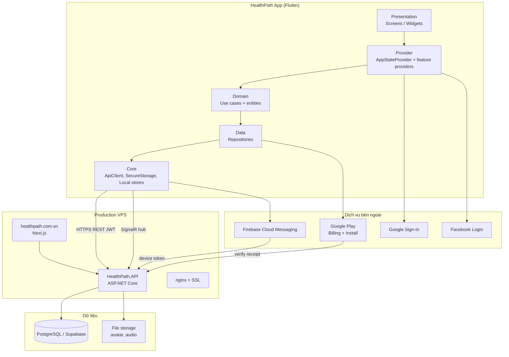
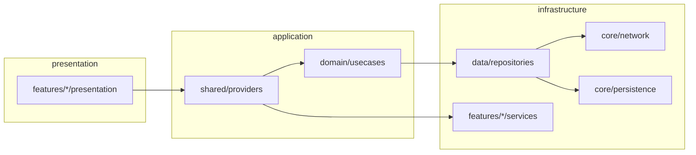
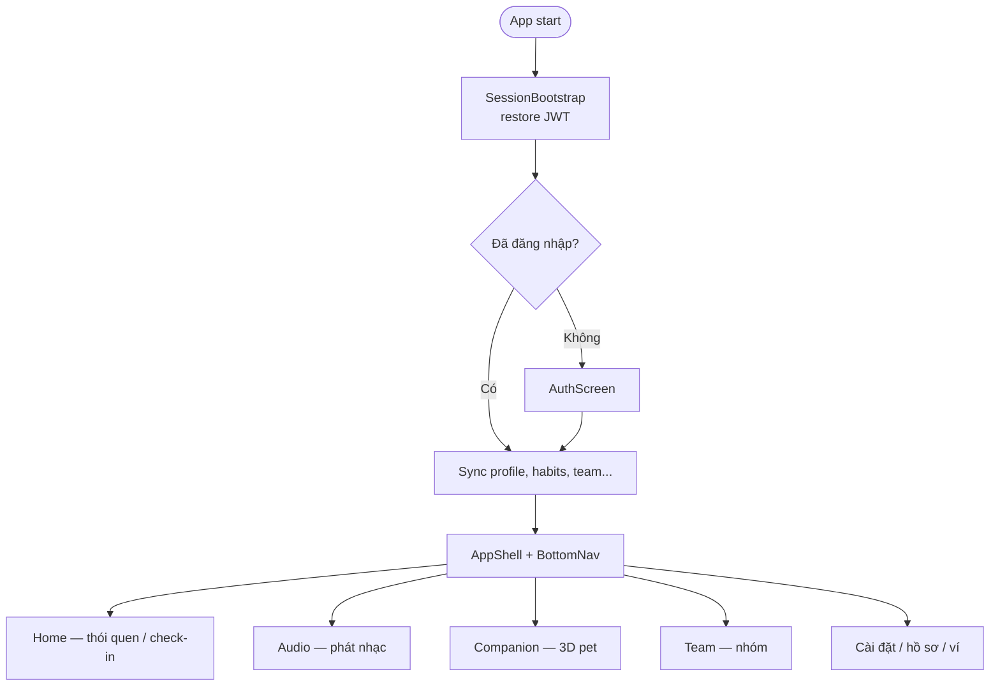
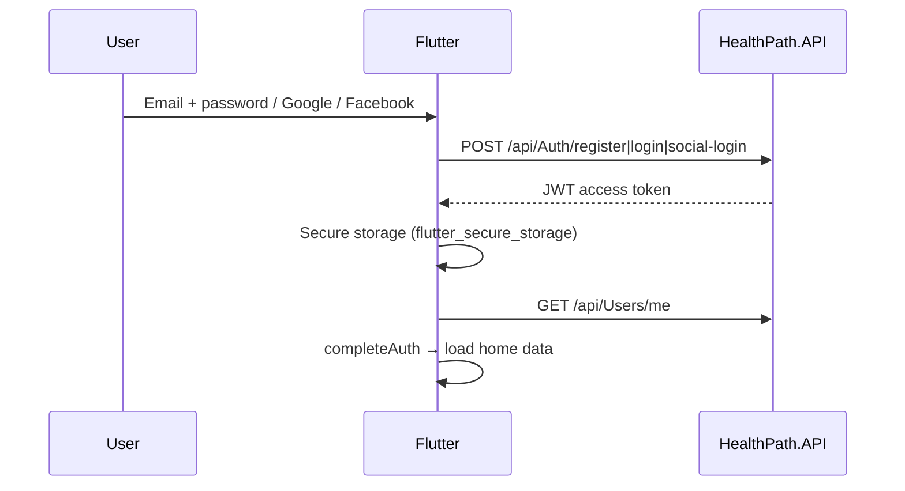
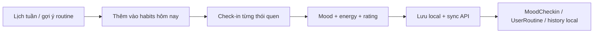
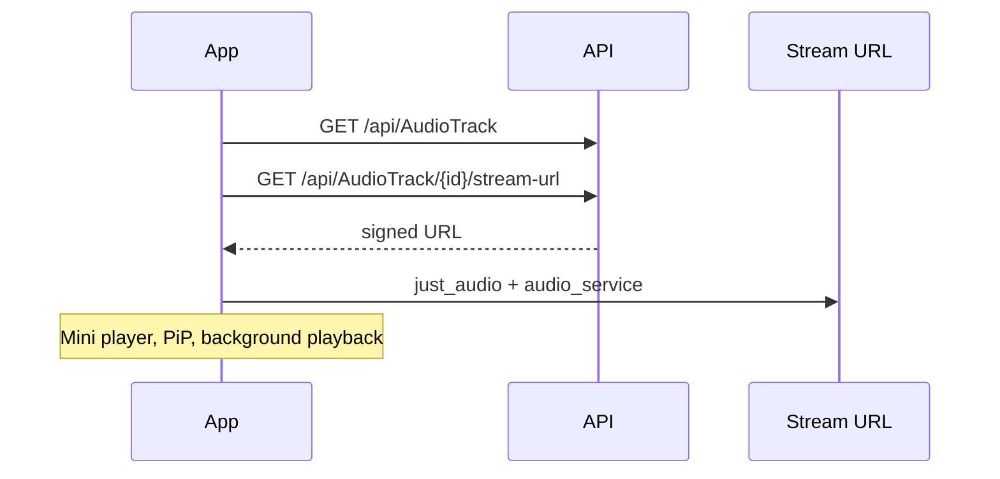
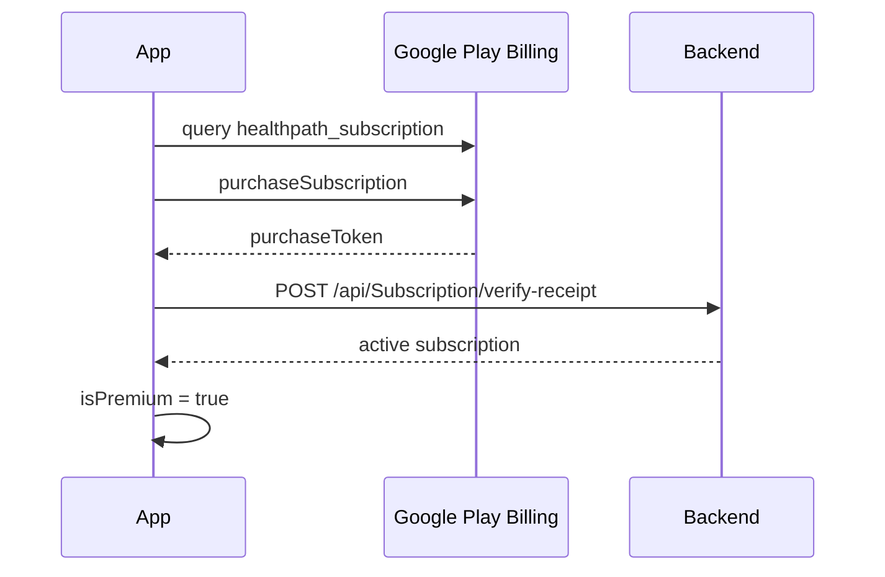
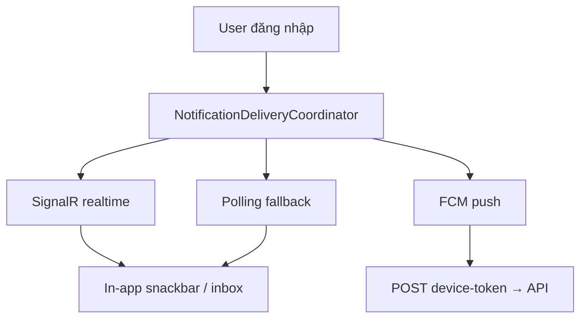
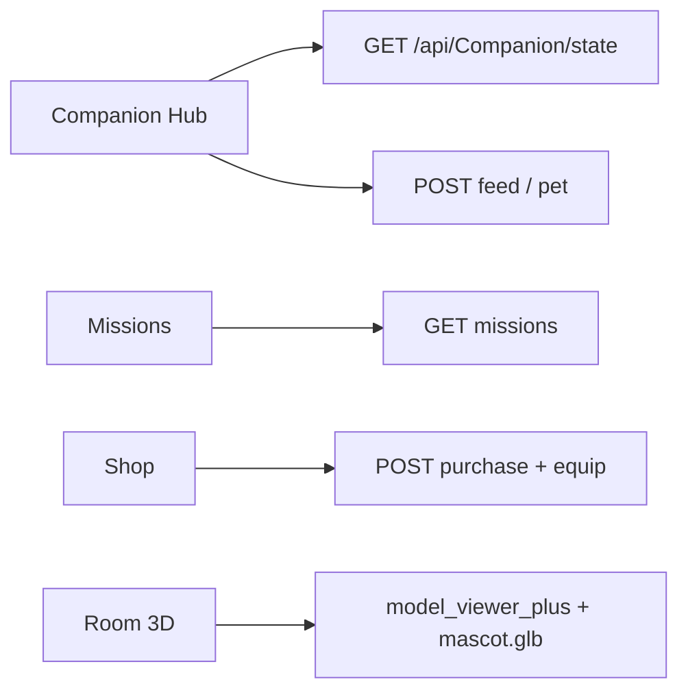

# HealthPath Mobile

Ứng dụng Flutter theo dõi thói quen, thư giãn và lối sống lành mạnh — kết nối backend ASP.NET Core (`health_backend`) và các dịch vụ Google/Facebook/Firebase.

| | |
|---|---|
| **Package** | `com.exodiateam.healthpath` |
| **Flutter** | 3.41+ (SDK `^3.11.5`) |
| **Phiên bản** | `1.0.16+18` |
| **API production** | `https://api.healthpath.com.vn` |
| **Website** | `https://healthpath.com.vn` |

---

## Mục lục

1. [Chạy nhanh (ưu tiên cao nhất)](#1-chạy-nhanh-ưu-tiên-cao-nhất)
2. [Yêu cầu môi trường](#2-yêu-cầu-môi-trường)
3. [Cấu hình `.env` và secret](#3-cấu-hình-env-và-secret)
4. [Chạy dev / production](#4-chạy-dev--production)
5. [Build AAB Google Play](#5-build-aab-google-play)
6. [Giới thiệu dự án](#6-giới-thiệu-dự-án)
7. [Kiến trúc & kết nối dịch vụ](#7-kiến-trúc--kết-nối-dịch-vụ)
8. [Luồng nghiệp vụ chính](#8-luồng-nghiệp-vụ-chính)
9. [Cấu trúc thư mục](#9-cấu-trúc-thư-mục)
10. [API backend sử dụng](#10-api-backend-sử-dụng)
11. [Đã hoàn thành](#11-đã-hoàn-thành)
12. [Chưa hoàn thành / hạn chế](#12-chưa-hoàn-thành--hạn-chế)
13. [Scripts tiện ích](#13-scripts-tiện-ích)
14. [Bảo mật & Git](#14-bảo-mật--git)

---

## 1. Chạy nhanh (ưu tiên cao nhất)

**Mục tiêu:** chạy app trên emulator/device trong &lt; 5 phút.

```powershell
cd D:\exe_project\health

# Lần đầu: tạo .env từ mẫu
.\scripts\setup_env.ps1

# Sửa .env — trỏ backend local (Android emulator)
# API_BASE_URL=https://10.0.2.2:7232

# Chạy backend trước (repo health_backend — VS F5 https://localhost:7232)

.\scripts\run_dev.ps1
```

| Banner login | Ý nghĩa |
|---|---|
| **Xanh** | Đã nối API (`API_BASE_URL` hợp lệ) |
| **Cam** | Offline / mock — không gọi backend |

**Chạy thẳng API production (không cần backend local):**

```powershell
.\scripts\run_prod.ps1
```

---

## 2. Yêu cầu môi trường

| Thành phần | Phiên bản / ghi chú |
|---|---|
| Flutter SDK | 3.41.x stable (`flutter doctor` không lỗi Android) |
| Android Studio | JBR 17+, Android SDK, emulator hoặc máy thật |
| JDK | 17 (script build dùng `Android Studio\jbr`) |
| Backend (dev) | `health_backend` — .NET 8, HTTPS `:7232` |
| Tùy chọn | `google-services.json` (FCM), keystore upload (Play) |

`android/local.properties` phải có `flutter.sdk=...` (tự sinh khi mở project Flutter lần đầu).

---

## 3. Cấu hình `.env` và secret

```powershell
copy .env.example .env   # hoặc .\scripts\setup_env.ps1
```

| Biến | Mô tả |
|---|---|
| `API_BASE_URL` | Base URL backend (không có `/api` ở cuối) |
| `JWT_ISSUER` | `healthpath` |
| `GOOGLE_CLIENT_ID` | OAuth Web client ID (serverClientId) |
| `FACEBOOK_APP_ID` | Facebook Login |
| `FACEBOOK_CLIENT_TOKEN` | Client token Facebook |
| `FCM_ENABLED` | `true` khi đã có `google-services.json` |

**Ưu tiên đọc config:** `--dart-define` &gt; `.env` &gt; `.env.example`

| Môi trường | `API_BASE_URL` |
|---|---|
| Emulator + backend HTTPS local | `https://10.0.2.2:7232` |
| Emulator + backend HTTP | `http://10.0.2.2:5048` |
| Windows desktop + backend local | `https://localhost:7232` |
| Production | `https://api.healthpath.com.vn` |
| Mock UI (không API) | để trống |

**Không commit:** `.env`, `android/key.properties`, `*.jks`, `google-services.json` (đã có trong `.gitignore`).

---

## 4. Chạy dev / production

### Dev với backend local

```powershell
# Backend: health_backend — F5 → https://localhost:7232/swagger
.\scripts\run_with_backend.ps1              # Android → 10.0.2.2:7232
.\scripts\run_with_backend.ps1 -Platform windows
```

### Dev thủ công

```powershell
flutter pub get
flutter run
```

### Production API trên máy dev

```powershell
.\scripts\run_prod.ps1
```

### Google / Facebook Login (dev)

1. Tạo OAuth clients trên Google Cloud / Facebook Developers (xem comment trong `.env.example`).
2. Android: thêm SHA-1 debug/upload vào Google Console.
3. `android/app/src/main/res/values/strings.xml` — Facebook App ID & client token.
4. Không cấu hình → app dùng **mock token** (chỉ khi backend `Development` + `AllowMockTokens=true`).

### FCM (push — tùy chọn)

1. Firebase Console → app Android `com.exodiateam.healthpath`.
2. Tải `google-services.json` → `android/app/google-services.json`.
3. `.env`: `FCM_ENABLED=true`.
4. Backend: cấu hình Firebase credential (xem `health_backend`).

---

## 5. Build AAB Google Play

```powershell
.\scripts\build_play_aab.ps1        # embed API production + .env
.\scripts\build_play_aab.ps1 -Clean # clean build
```

Output: `release/healthpath-<version>-prod-release.aab`

- Script tự ghi `.env` production, `--dart-define` API URL.
- Cần `android/key.properties` + `upload-keystore.jks` (script `create_upload_keystore.ps1` nếu chưa có).
- **Google Play Billing** chỉ test được khi cài bản từ Play Internal/Closed testing.

---

## 6. Giới thiệu dự án

**HealthPath** là app **theo dõi thói quen & thư giãn** (không phải ứng dụng y tế). Người dùng:

- Check-in thói quen / năng lượng / tâm trạng hàng ngày
- Nghe nhạc thư giãn, bài tập audio
- Tham gia nhóm, thử thách check-in
- Nuôi **bạn đồng hành ảo** 3D (companion)
- Nâng cấp **HealthPath Pro** qua Google Play subscription

**Đối tượng:** thị trường Việt Nam, giao diện tiếng Việt.

**Repo liên quan:**

| Repo / folder | Vai trò |
|---|---|
| `health` (repo này) | Flutter mobile |
| `health_backend` | REST API + SignalR + Supabase/PostgreSQL |
| `health_web` | Landing, privacy policy, delete-account |
| `deploy` | Docker/nginx deploy VPS |

---

## 7. Kiến trúc & kết nối dịch vụ

### 7.1 Tổng quan hệ thống



### 7.2 Kiến trúc lớp trong app (Clean-ish)



| Lớp | Thư mục | Trách nhiệm |
|---|---|---|
| **Presentation** | `lib/features/*/presentation` | UI, navigation tab |
| **State** | `lib/shared/providers`, feature providers | `AppStateProvider`, companion state |
| **Domain** | `lib/domain/` | Use cases, entities, repository interfaces |
| **Data** | `lib/data/repositories/` | Gọi API, map JSON |
| **Core** | `lib/core/` | HTTP, JWT, secure storage, env, DI |
| **Services** | `lib/features/*/services/` | Audio, billing, notifications, push |

DI tập trung: `lib/core/di/app_dependencies.dart` (Provider).

### 7.3 Tab & shell



Companion có **nested Navigator** riêng: Hub → Missions / Shop / Room.

---

## 8. Luồng nghiệp vụ chính

### 8.1 Đăng ký / đăng nhập



- Đăng ký email: OTP `verify-register-otp`.
- Quên mật khẩu: `forgot-password` → `reset-password-with-otp`.

### 8.2 Thói quen & check-in hàng ngày



- Dữ liệu habits: lưu local (`habit_history`, `completed_habits`, `custom_routines`) + đồng bộ mood/routine qua API khi có mạng.

### 8.3 Audio



- Track premium: khóa nếu chưa `isPremium`.

### 8.4 Subscription (Google Play)



Product ID: `healthpath_subscription` (base plans monthly/yearly).

### 8.5 Thông báo



### 8.6 Companion (pet 3D)



Chat companion: **mock local** (chưa nối AI backend) — xem mục 12.

### 8.7 Team / nhóm

- Tạo nhóm, mời bằng code, join public, check-in nhóm, xem thành viên & challenge.
- API: `/api/Group/*`, `/api/GroupChallenge/*`.

---

## 9. Cấu trúc thư mục

```
health/
├── lib/
│   ├── main.dart                 # Entry, Provider root
│   ├── app/                      # AppShell, SessionBootstrap
│   ├── core/
│   │   ├── config/               # env_config, play_store_links
│   │   ├── di/                   # app_dependencies.dart
│   │   ├── network/              # api_client
│   │   ├── persistence/          # local stores (habits, profile...)
│   │   └── security/             # JWT, secure storage
│   ├── domain/                   # entities, repositories (abstract), usecases
│   ├── data/repositories/        # *RepositoryImpl → REST
│   ├── features/
│   │   ├── auth/
│   │   ├── home/
│   │   ├── audio/
│   │   ├── companion/
│   │   ├── team/
│   │   ├── settings/
│   │   ├── payment/
│   │   ├── subscription/
│   │   └── notifications/
│   └── shared/                   # models, widgets, app_state_provider
├── android/                      # Gradle, manifest, signing
├── ios/
├── assets/                       # companion 3D, branding
├── packages/model_viewer_plus/   # Fork local — 3D viewer
├── scripts/                      # build, run, setup
├── release/                      # AAB output (gitignored)
├── .env.example
└── pubspec.yaml
```

---

## 10. API backend sử dụng

Base: `{API_BASE_URL}` — ví dụ production `https://api.healthpath.com.vn`

| Nhóm | Endpoints chính |
|---|---|
| **Auth** | `POST /api/Auth/register`, `login`, `social-login`, OTP, đổi mật khẩu |
| **User** | `GET/PUT /api/Users/me`, `POST /api/File/avatar` |
| **Routine** | `GET /api/Routine` |
| **UserRoutine** | schedule, recurring, start/complete |
| **MoodCheckin** | CRUD + stats |
| **AudioTrack** | list, categories, stream-url, favorites, play |
| **Group** | CRUD nhóm, join, check-in, members |
| **GroupChallenge** | challenges theo nhóm |
| **Companion** | state, feed, missions, catalog, purchase, equip |
| **Notification** | inbox, settings, device-token |
| **Subscription** | plans, my-subscription, verify-receipt |

Swagger local: `https://localhost:7232/swagger`

---

## 11. Đã hoàn thành

- [x] Đăng ký / đăng nhập email + OTP xác thực
- [x] Google & Facebook social login (production keys)
- [x] JWT session restore, đổi mật khẩu, quên mật khẩu
- [x] Hồ sơ: họ tên, SĐT, avatar upload
- [x] Home: thói quen hàng ngày, check-in, mood/energy, lịch sử local
- [x] Weekly plan / recurring routines (API + local cache)
- [x] Thư viện audio: stream, favorite, mini player, background, PiP
- [x] Companion 3D: pet, phòng, shop, missions (API)
- [x] Team: tạo/join nhóm, check-in, thành viên
- [x] Thông báo: inbox, cài đặt, SignalR + poll + FCM
- [x] Google Play subscription + verify backend
- [x] Production API (`api.healthpath.com.vn`) embed trong AAB release
- [x] Play Console: Data safety, privacy URL, delete-account web page
- [x] Manifest: loại bỏ `AD_ID` (không dùng quảng cáo)

---

## 12. Chưa hoàn thành / hạn chế

| Hạng mục | Trạng thái |
|---|---|
| **Xóa tài khoản trong app** | Chỉ có flow web `healthpath.com.vn/delete-account` + email |
| **Companion chat AI** | Mock local (`CompanionMockDataSource`), chưa gọi LLM backend |
| **Thanh toán MoMo / ví / thẻ** | Không có — chỉ Google Play Billing |
| **iOS build / App Store** | Cấu hình cơ bản có; chưa release iOS |
| **Thiết bị đeo / health kit** | Không thu thập |
| **Offline-first đầy đủ** | Habits cache local; nhiều màn cần mạng |
| **Đa ngôn ngữ** | UI chủ yếu tiếng Việt |
| **Unit / integration tests** | Rất ít (`test/auth_repository_test.dart`) |
| **Team mock fallback** | Một số state demo khi không có API |
| **Play organization account** | Có thể cần tài khoản tổ chức nếu Google vẫn flag tên HealthPath |

---

## 13. Scripts tiện ích

| Script | Mục đích |
|---|---|
| `scripts/setup_env.ps1` | Tạo `.env` từ `.env.example` |
| `scripts/run_dev.ps1` | `flutter pub get` + `flutter run` |
| `scripts/run_with_backend.ps1` | Ghi `.env` emulator + chạy |
| `scripts/run_prod.ps1` | Ghi `.env` production API + chạy |
| `scripts/build_play_aab.ps1` | **AAB Play Store** (production API) |
| `scripts/build_release.ps1` | APK/AAB release chung |
| `scripts/create_upload_keystore.ps1` | Tạo keystore upload lần đầu |
| `scripts/get_android_signing_sha.ps1` | SHA-1 cho Google OAuth |

---

## 14. Bảo mật & Git

**Không push:**

- `.env`, `android/key.properties`, `*.jks`, `google-services.json`
- `build/`, `release/*.aab`, `android/local.properties`

**Nên push:** `.env.example`, toàn bộ `lib/`, `pubspec.yaml`, `android/` (trừ secret).

```powershell
git check-ignore -v .env android\key.properties release\*.aab
```

---

## Liên hệ & tài liệu thêm

- SRS chi tiết (IEEE): `../SRS_HealthPath_Mobile.md` (một số mục đã lỗi thời — ưu tiên README này + code).
- Backend setup: `../health_backend/README.md` (nếu có).
- Deploy VPS: `../deploy/`.

---

*Cập nhật: tháng 6/2026 — HealthPath / Exodia Team*
